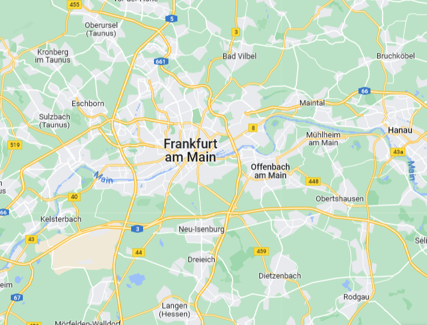

# Air Quality App

## Overview

Air Quality App is a university project designed to monitor and analyze air quality using data collected from external embedded sensors. The application stores sensor data in a database and provides a modern graphical user interface for users to view, interpret, and understand air quality in different areas. Official formulas are used to indicate whether the air in a given location is clean or not, ensuring reliable and scientifically-backed results.

## Features

- **Sensor Data Collection:** Gathers real-time air quality information from external embedded sensors.
- **Database Storage:** Efficiently saves all measurements for historical analysis and reporting.
- **Graphical User Interface:** Intuitive and visually appealing interface for users to explore air quality data by location.
- **Official Air Quality Formulas:** Utilizes recognized formulas to assess and display air cleanliness status.
- **Multi-location Support:** View air quality for multiple areas, including Kelsterbach, Maintal, and Rodgau.
- **Settings & Customization:** Easily configure database connections and application preferences.

## Technologies Used

- **Java** (with JavaFX for GUI)
- **FXML** for UI layout
- **Embedded Sensors** for data collection
- **Database Integration** for persistent storage

## Project Structure

- `src/main/java/com/project/airquality/` - Main application logic and controllers
- `src/main/java/database/` - Database configuration and management
- `src/main/java/objects/` - Data models for locations and measurements
- `src/main/resources/com/project/airquality/` - FXML layouts, images, and styles

## Getting Started

1. **Clone the repository:**
   ```sh
   git clone https://github.com/MichalCzudziak/Air-Quality-App.git
   ```
2. **Configure the database:**
   - Update connection settings in `connectDB.fxml` or via the settings panel in the app.
3. **Run the application:**
   - Use the provided Maven wrapper (`mvnw` or `mvnw.cmd`) to build and launch the app.
   ```sh
   ./mvnw javafx:run
   ```

## Screenshots




## License

This project was developed as part of a university course and is intended for educational purposes.

---

**Authors:**

- Michal Czudziak
- Fatih
- Haki

**University:**

- Frankfurt University of Applied Science

---

For more information, refer to the official documentation or contact the project maintainers.
